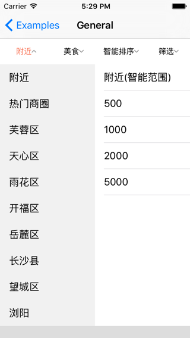
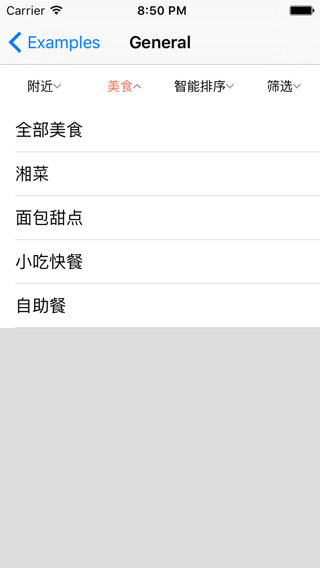
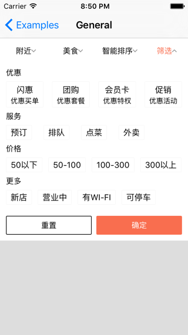
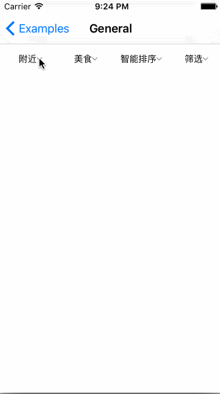

[](http://cocoapods.org/pods/DMLSelector)
[](http://cocoapods.org/pods/DMLSelector)
[](http://cocoapods.org/pods/DMLSelector)

# DMLSelector

## DMLSelector is a drop down style selector, which support select in single, double table and collection view.

## Screenshots




## Video


## Features

* Support single table, double table and collection view style selector
* Support exclusive select for specific section
* Support custom image for selector component

## Usage

```
// Initialization

DMLSelector *selector = [[DMLSelector alloc] initWithFrame:CGRectZero];
selector.dataSource = self;
selector.delegate = self;

// Implement dataSource

- (NSUInteger)numberOfComponentsInSelector:(DMLSelector *)selector
{
    return self.selectorComponentDescriptors.count;
}

- (DMLSelectorComponentDescriptor *)selector:(DMLSelector *)selector componentDescriptorForComponentAtIndex:(NSUInteger)index
{
    return self.selectorComponentDescriptors[index];
}

// Implement delegate 

- (void)selector:(DMLSelector *)selector didSelectComponentAtIndexPath:(DMLSelectorIndexPath *)indexPath
{
    NSLog(@"%s\n values:%@", __func__, selector.selectorValues);
}

```

## Example

To run the example project, clone the repo, and run `pod install` from the Example directory first.

## Requirements

* iOS 8.0+

## Installation

DMLSelector is available through [CocoaPods](http://cocoapods.org). To install
it, simply add the following line to your Podfile:

```ruby
pod "DMLSelector"
```

## License

DMLSelector is available under the MIT license. See the LICENSE file for more info.
